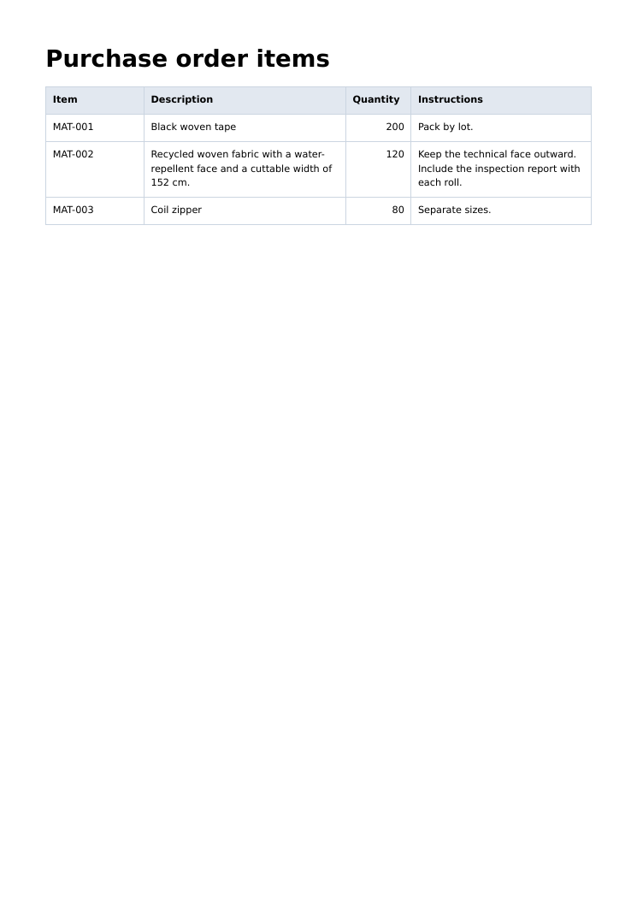
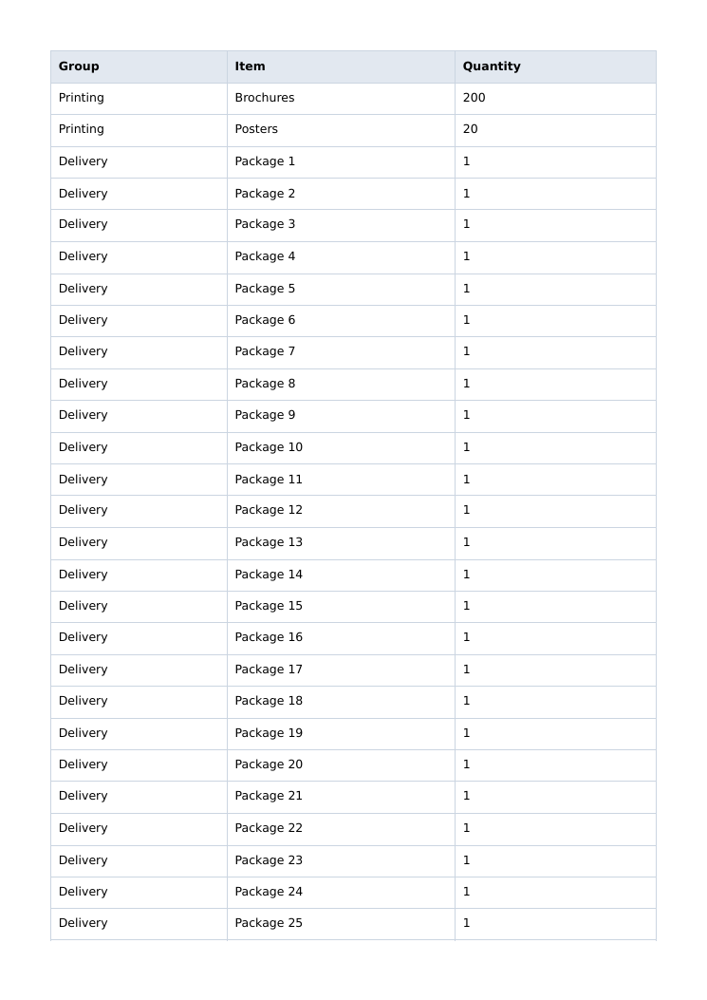
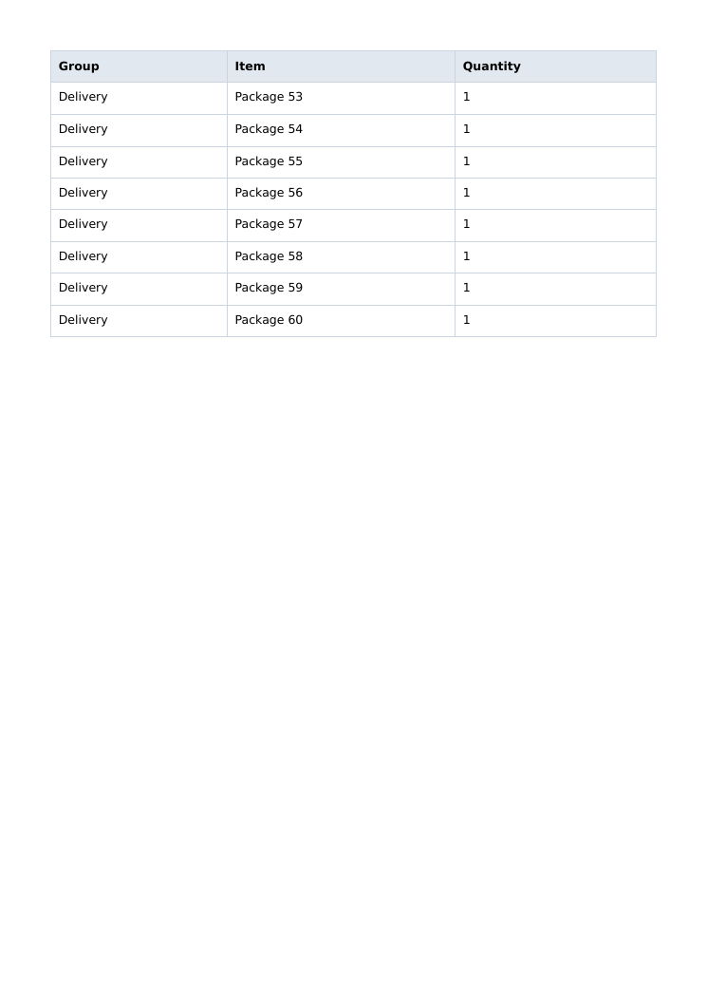
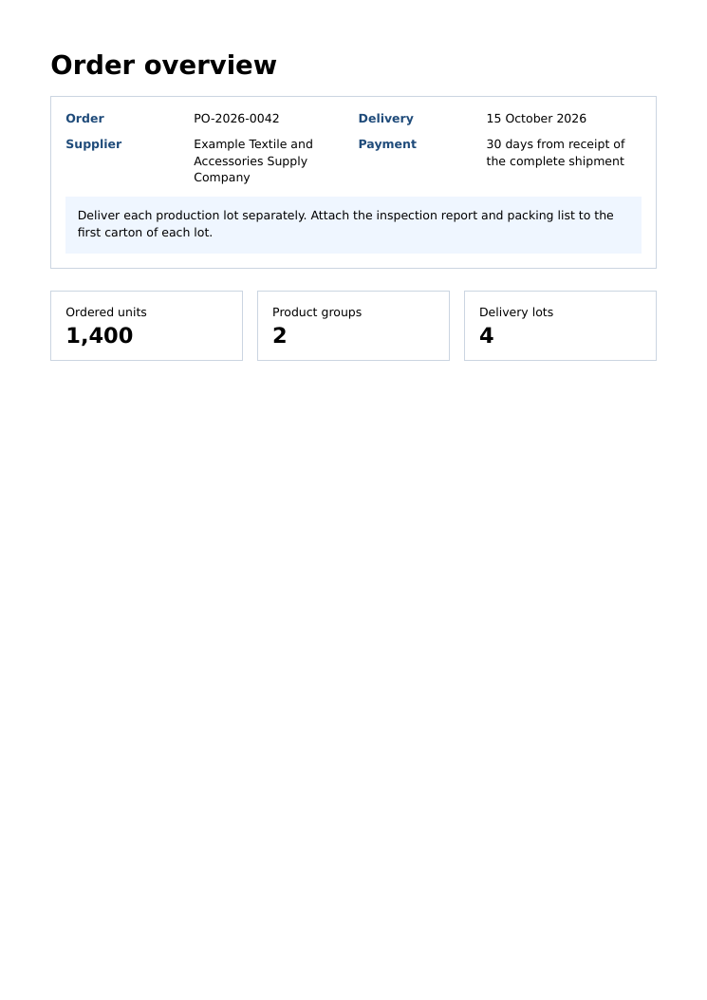
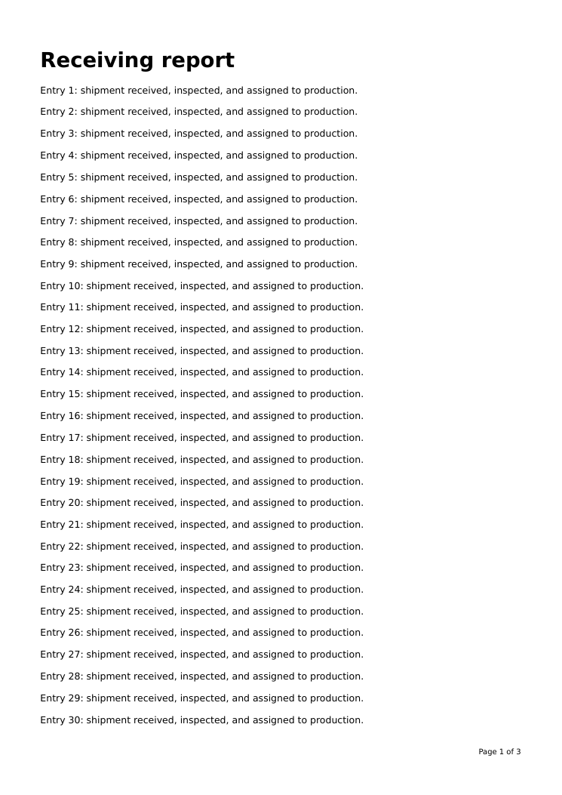
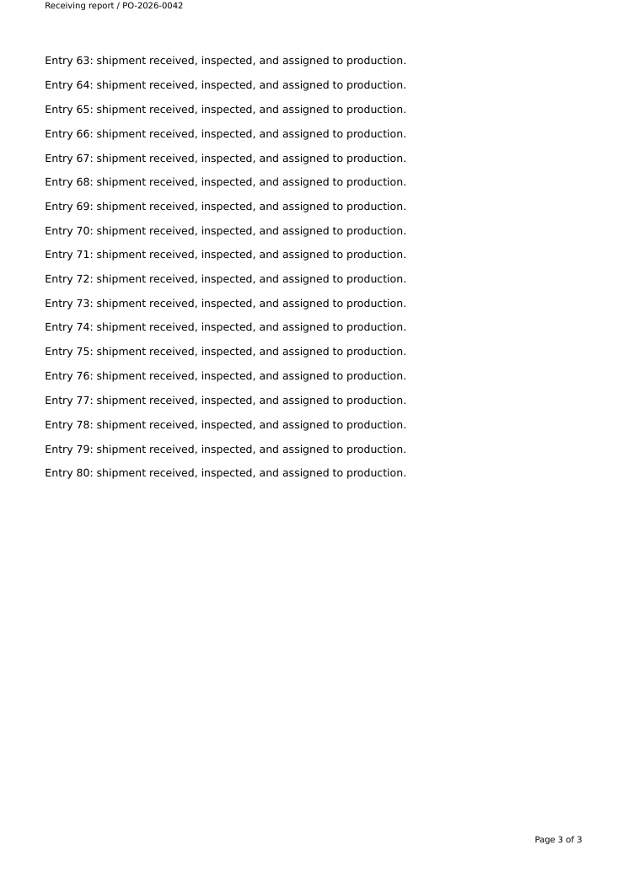
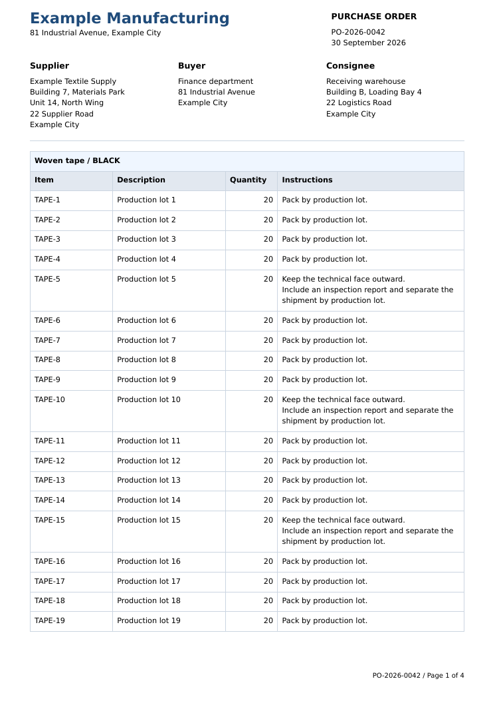
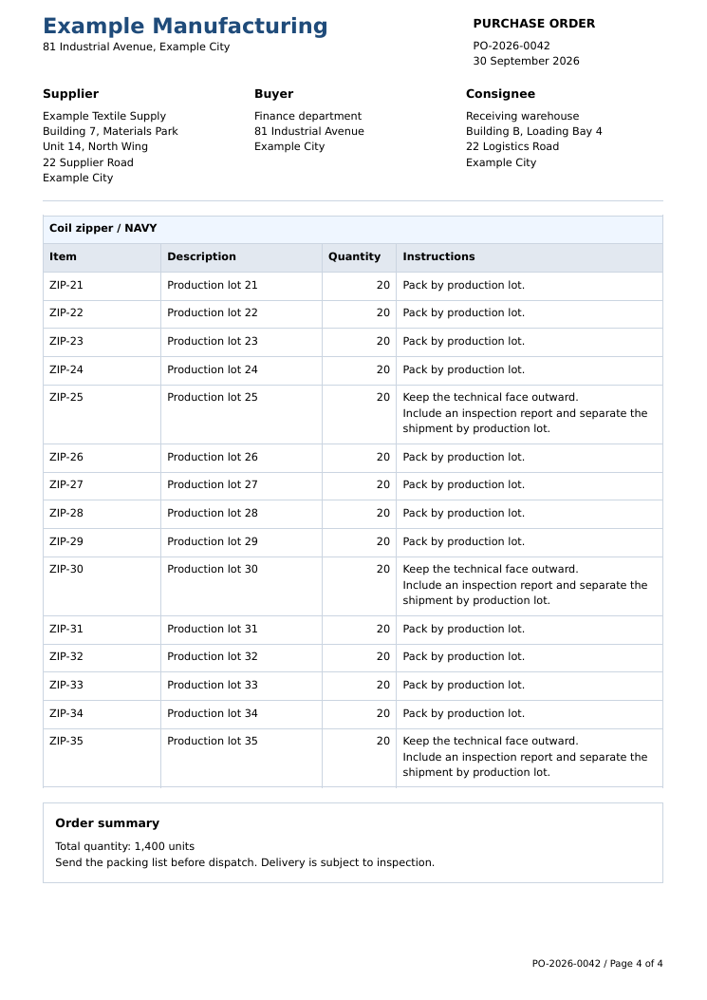
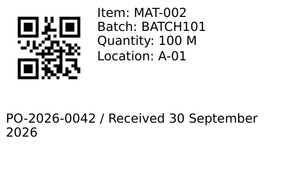
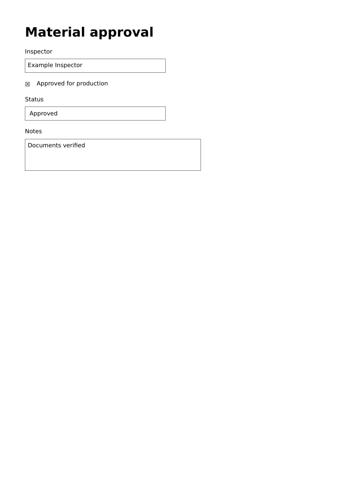

# Create PDFs from HTML

Use `NativeElixirPdfUtilities.HtmlToPdf` to turn application templates into PDF bytes or files. Choose a layout below, then combine the patterns for your document.

| I want to                                         | Example                                |
| ------------------------------------------------- | -------------------------------------- |
| Render a small document or an HTML file           | [Simple HTML](#simple-html)             |
| Let descriptions determine row heights            | [Tables](#tables)                       |
| Arrange headers, address panels, or summary cards | [Flex and grid](#flex-and-grid)         |
| Repeat headings and paginate a purchase order     | [Multiple pages](#multiple-pages)       |
| Print a batch of small labels                     | [Labels](#labels)                       |
| Add logos, approved asset bytes, and custom fonts | [Images and fonts](#images-and-fonts)   |
| Add PDF metadata, bookmarks, or fillable fields   | [Document features](#document-features) |

Each recipe has complete HTML, its render command, and the actual native PDF output. Save the HTML using the filename shown, then run the Elixir code in your application or IEx session from that directory. You can also download the linked HTML and PDF files.

The examples use synthetic data and the bundled DejaVu Sans font. System font discovery is disabled so the layout does not depend on installed fonts. See [HTML and CSS support](html-to-pdf-compatibility.md) for the supported subset and [Diagnostics](diagnostics.md) for failures.

## Simple HTML

### Render HTML

`render/2` returns PDF bytes. This small document uses physical units for printable margins and CSS for the content:

Save as `delivery-confirmation.html`.

```html
<!doctype html>
<html lang="en">
<head>
<meta charset="utf-8">
<title>Delivery confirmation</title>
<style>
html, body { margin: 0; padding: 0; }
body { font-family: "DejaVu Sans"; font-size: 10pt; line-height: 15pt; }
h1 { font-size: 22pt; line-height: 26pt; margin: 0 0 12pt; color: #1f4b7a; }
h2 { font-size: 12pt; line-height: 16pt; margin: 0 0 6pt; }
p { margin: 0 0 8pt; }
</style>
</head>
<body>
<h1>Delivery confirmation</h1>
<p>Order PO-2026-0042 was received on 30 September 2026.</p>
<p>Contact: <a href="mailto:receiving@example.com">Receiving team</a></p>
</body>
</html>
```

Render it:

```elixir
alias NativeElixirPdfUtilities.HtmlToPdf

html = File.read!("delivery-confirmation.html")
{:ok, pdf} = HtmlToPdf.render(html, page_size: :a4, margin: "18mm", system_font_discovery: false)
File.write!("delivery-confirmation.pdf", pdf)
```

[Open PDF](assets/html-to-pdf-examples/delivery-confirmation.pdf) · [Download HTML](assets/html-to-pdf-examples/delivery-confirmation.html)


### Render a file

Keep HTML and CSS in application files when templates are shared with another renderer:

Save as `invoice.html`.

```html
<!doctype html>
<html lang="en">
<head>
<meta charset="utf-8">
<title>Invoice</title>
<style>
html, body { margin: 0; padding: 0; }
body { font-family: "DejaVu Sans"; font-size: 10pt; line-height: 15pt; }
h1 { font-size: 22pt; line-height: 26pt; margin: 0 0 12pt; }
h2 { font-size: 12pt; line-height: 16pt; margin: 0 0 6pt; }
p { margin: 0 0 8pt; }
</style>
</head>
<body>
<h1>Invoice INV-2026-0042</h1><p>Example customer</p>
</body>
</html>
```

Save as `invoice.css`.

```css
body { color: #1f4b7a; }
h1 { border-bottom: 1pt solid #cbd5e1; padding-bottom: 12pt; }
```

Render it:

```elixir
alias NativeElixirPdfUtilities.HtmlToPdf

:ok =
  HtmlToPdf.render_file("invoice.html", "invoice.pdf",
    page_size: :a4,
    margin: "18mm",
    stylesheets: [{:file, "invoice.css"}],
    base_url: ".",
    system_font_discovery: false
  )
```

[Open PDF](assets/html-to-pdf-examples/invoice.pdf) · [Download HTML](assets/html-to-pdf-examples/invoice.html) · [Download CSS](assets/html-to-pdf-examples/invoice.css)


Use `{:css, css}` for an in-memory stylesheet. Set `:base_url` explicitly for relative images and fonts; it is not inferred from the HTML file's directory.

## Tables

### Let descriptions determine row heights

Purchase orders and invoices often have short item codes beside long descriptions or instructions. Set column widths and let each row grow with its wrapped text. Omit fixed row heights.

Save as `purchase-order-items.html`.

```html
<!doctype html>
<html lang="en">
<head>
<meta charset="utf-8">
<title>Purchase order items</title>
<style>
html, body { margin: 0; padding: 0; }
body { font-family: "DejaVu Sans"; font-size: 9pt; line-height: 13pt; }
h1 { font-size: 22pt; line-height: 26pt; margin: 0 0 12pt; }
h2 { font-size: 12pt; line-height: 16pt; margin: 0 0 6pt; }
p { margin: 0 0 8pt; }
table { width: 100%; border-collapse: collapse; table-layout: fixed; }
th, td { border: 1pt solid #cbd5e1; padding: 6pt; text-align: left; vertical-align: top; }
th { background: #e2e8f0; }
.quantity { text-align: right; }
.instructions { white-space: pre-line; }
</style>
</head>
<body>
<h1>Purchase order items</h1>
<table>
  <colgroup>
    <col style="width: 18%">
    <col style="width: 37%">
    <col style="width: 12%">
    <col style="width: 33%">
  </colgroup>
  <thead><tr><th>Item</th><th>Description</th><th>Quantity</th><th>Instructions</th></tr></thead>
  <tbody><tr><td>MAT-001</td><td>Black woven tape</td><td class="quantity">200</td><td class="instructions">Pack by lot.</td></tr>
<tr><td>MAT-002</td><td>Recycled woven fabric with a water-repellent face and a cuttable width of 152 cm.</td><td class="quantity">120</td><td class="instructions">Keep the technical face outward.
Include the inspection report with each roll.</td></tr>
<tr><td>MAT-003</td><td>Coil zipper</td><td class="quantity">80</td><td class="instructions">Separate sizes.</td></tr>
</tbody>
</table>
</body>
</html>
```

Render it:

```elixir
alias NativeElixirPdfUtilities.HtmlToPdf

:ok =
  HtmlToPdf.render_file("purchase-order-items.html", "purchase-order-items.pdf",
    page_size: :a4,
    margin: "15mm",
    system_font_discovery: false
  )
```

[Open PDF](assets/html-to-pdf-examples/purchase-order-items.pdf) · [Download HTML](assets/html-to-pdf-examples/purchase-order-items.html)



The second row is taller than the first because its description and instructions wrap. `white-space: pre-line` also preserves the explicit instruction line break. Add `colspan` for summary rows or nest a small table inside a cell when the document needs grouped details.

### Paginate a table with row groups

Use one `<thead>` for repeated column headings and one `<tbody>` per group. `break-inside: avoid` keeps a group together when it fits on a page. Render the whole table in one call.

Save as `grouped-table.html`.

```html
<!doctype html>
<html lang="en">
<head>
<meta charset="utf-8">
<title>Grouped table</title>
<style>
html, body { margin: 0; padding: 0; }
body { font-family: "DejaVu Sans"; font-size: 10pt; line-height: 14pt; }
h1 { font-size: 22pt; line-height: 26pt; margin: 0 0 12pt; }
h2 { font-size: 12pt; line-height: 16pt; margin: 0 0 6pt; }
p { margin: 0 0 8pt; }
table { width: 100%; border-collapse: collapse; }
th, td { border: 1pt solid #cbd5e1; padding: 6pt; text-align: left; }
th { background: #e2e8f0; }
tbody { break-inside: avoid; }
</style>
</head>
<body>
<table>
  <thead><tr><th>Group</th><th>Item</th><th>Quantity</th></tr></thead>
  <tbody>
    <tr><td>Printing</td><td>Brochures</td><td>200</td></tr>
    <tr><td>Printing</td><td>Posters</td><td>20</td></tr></tbody>
<tbody><tr><td>Delivery</td><td>Package 1</td><td>1</td></tr>
<tr><td>Delivery</td><td>Package 2</td><td>1</td></tr>
<tr><td>Delivery</td><td>Package 3</td><td>1</td></tr>
<tr><td>Delivery</td><td>Package 4</td><td>1</td></tr>
<tr><td>Delivery</td><td>Package 5</td><td>1</td></tr>
<tr><td>Delivery</td><td>Package 6</td><td>1</td></tr>
<tr><td>Delivery</td><td>Package 7</td><td>1</td></tr>
<tr><td>Delivery</td><td>Package 8</td><td>1</td></tr>
<tr><td>Delivery</td><td>Package 9</td><td>1</td></tr>
<tr><td>Delivery</td><td>Package 10</td><td>1</td></tr>
<tr><td>Delivery</td><td>Package 11</td><td>1</td></tr>
<tr><td>Delivery</td><td>Package 12</td><td>1</td></tr>
<tr><td>Delivery</td><td>Package 13</td><td>1</td></tr>
<tr><td>Delivery</td><td>Package 14</td><td>1</td></tr>
<tr><td>Delivery</td><td>Package 15</td><td>1</td></tr>
<tr><td>Delivery</td><td>Package 16</td><td>1</td></tr>
<tr><td>Delivery</td><td>Package 17</td><td>1</td></tr>
<tr><td>Delivery</td><td>Package 18</td><td>1</td></tr>
<tr><td>Delivery</td><td>Package 19</td><td>1</td></tr>
<tr><td>Delivery</td><td>Package 20</td><td>1</td></tr>
<tr><td>Delivery</td><td>Package 21</td><td>1</td></tr>
<tr><td>Delivery</td><td>Package 22</td><td>1</td></tr>
<tr><td>Delivery</td><td>Package 23</td><td>1</td></tr>
<tr><td>Delivery</td><td>Package 24</td><td>1</td></tr>
<tr><td>Delivery</td><td>Package 25</td><td>1</td></tr>
<tr><td>Delivery</td><td>Package 26</td><td>1</td></tr>
<tr><td>Delivery</td><td>Package 27</td><td>1</td></tr>
<tr><td>Delivery</td><td>Package 28</td><td>1</td></tr>
<tr><td>Delivery</td><td>Package 29</td><td>1</td></tr>
<tr><td>Delivery</td><td>Package 30</td><td>1</td></tr>
<tr><td>Delivery</td><td>Package 31</td><td>1</td></tr>
<tr><td>Delivery</td><td>Package 32</td><td>1</td></tr>
<tr><td>Delivery</td><td>Package 33</td><td>1</td></tr>
<tr><td>Delivery</td><td>Package 34</td><td>1</td></tr>
<tr><td>Delivery</td><td>Package 35</td><td>1</td></tr>
<tr><td>Delivery</td><td>Package 36</td><td>1</td></tr>
<tr><td>Delivery</td><td>Package 37</td><td>1</td></tr>
<tr><td>Delivery</td><td>Package 38</td><td>1</td></tr>
<tr><td>Delivery</td><td>Package 39</td><td>1</td></tr>
<tr><td>Delivery</td><td>Package 40</td><td>1</td></tr>
<tr><td>Delivery</td><td>Package 41</td><td>1</td></tr>
<tr><td>Delivery</td><td>Package 42</td><td>1</td></tr>
<tr><td>Delivery</td><td>Package 43</td><td>1</td></tr>
<tr><td>Delivery</td><td>Package 44</td><td>1</td></tr>
<tr><td>Delivery</td><td>Package 45</td><td>1</td></tr>
<tr><td>Delivery</td><td>Package 46</td><td>1</td></tr>
<tr><td>Delivery</td><td>Package 47</td><td>1</td></tr>
<tr><td>Delivery</td><td>Package 48</td><td>1</td></tr>
<tr><td>Delivery</td><td>Package 49</td><td>1</td></tr>
<tr><td>Delivery</td><td>Package 50</td><td>1</td></tr>
<tr><td>Delivery</td><td>Package 51</td><td>1</td></tr>
<tr><td>Delivery</td><td>Package 52</td><td>1</td></tr>
<tr><td>Delivery</td><td>Package 53</td><td>1</td></tr>
<tr><td>Delivery</td><td>Package 54</td><td>1</td></tr>
<tr><td>Delivery</td><td>Package 55</td><td>1</td></tr>
<tr><td>Delivery</td><td>Package 56</td><td>1</td></tr>
<tr><td>Delivery</td><td>Package 57</td><td>1</td></tr>
<tr><td>Delivery</td><td>Package 58</td><td>1</td></tr>
<tr><td>Delivery</td><td>Package 59</td><td>1</td></tr>
<tr><td>Delivery</td><td>Package 60</td><td>1</td></tr></tbody>
</table>
</body>
</html>
```

Render it:

```elixir
alias NativeElixirPdfUtilities.HtmlToPdf

:ok =
  HtmlToPdf.render_file("grouped-table.html", "grouped-table.pdf",
    page_size: :a4,
    margin: "15mm",
    system_font_discovery: false
  )
```

[Open PDF](assets/html-to-pdf-examples/grouped-table.pdf) · [Download HTML](assets/html-to-pdf-examples/grouped-table.html)



<details>
<summary>Last page</summary>



</details>

The Printing group stays together. The Delivery group is too tall for a page and splits between rows, with column headings repeated on each continuation page. Collapsed borders retain the bottom edge at page breaks.

Individual table rows do not split across pages. Keep each row small enough to fit on a fresh page with its heading. See [table page breaks](html-to-pdf-compatibility.md#table-page-breaks) for the exact behavior.

## Flex and grid

### Arrange a document header with flex

Use flex for a company block beside document details, or for two address panels. This header combines a fixed-size logo with text that takes the remaining width:

Save as `flex-header.html`.

```html
<!doctype html>
<html lang="en">
<head>
<meta charset="utf-8">
<title>Flex header</title>
<style>
html, body { margin: 0; padding: 0; }
body { font-family: "DejaVu Sans"; font-size: 9pt; line-height: 13pt; }
h1 { font-size: 18pt; line-height: 22pt; margin: 0; color: #1f4b7a; }
h2 { font-size: 11pt; line-height: 16pt; margin: 0; margin-bottom: 6pt; }
p { margin: 0; }
.header { display: flex; align-items: flex-start; gap: 16pt; }
.company { display: flex; flex: 1 1 0; gap: 10pt; align-items: center; }
.company img { flex: 0 0 36pt; width: 36pt; height: 36pt; }
.company-text { flex: 1 1 0; }
.document { flex: 0 0 145pt; text-align: right; }
.addresses { display: flex; gap: 14pt; margin-top: 24pt; }
.address { flex: 1 1 0; border: 1pt solid #cbd5e1; padding: 10pt; }
</style>
</head>
<body>
<div class="header">
  <div class="company">
    
    <div class="company-text">
      <h2>Example Manufacturing</h2>
      <p>81 Industrial Avenue<br>Example City<br>receiving@example.com</p>
    </div>
  </div>
  <div class="document">
    <h1>PURCHASE ORDER</h1>
    <p>PO-2026-0042<br>30 September 2026</p>
  </div>
</div>
<div class="addresses">
  <div class="address"><h2>Bill to</h2><p>Finance department<br>81 Industrial Avenue</p></div>
  <div class="address"><h2>Deliver to</h2><p>Receiving warehouse<br>Building B, Loading Bay 4<br>22 Logistics Road</p></div>
</div>
</body>
</html>
```

Render it:

```elixir
alias NativeElixirPdfUtilities.HtmlToPdf

:ok =
  HtmlToPdf.render_file("flex-header.html", "flex-header.pdf",
    page_size: :a4,
    margin: "15mm",
    system_font_discovery: false
  )
```

[Open PDF](assets/html-to-pdf-examples/flex-header.pdf) · [Download HTML](assets/html-to-pdf-examples/flex-header.html)


The address panels share the available width and stretch to the height required by the longer address. The logo retains its explicit dimensions. Use `align-items: flex-start` on the address row if panels should keep their own heights.

### Build a summary panel with grid

Use grid for aligned label/value pairs and a note that spans the full panel. Track widths are defined once; row heights follow the content:

Save as `grid-summary.html`.

```html
<!doctype html>
<html lang="en">
<head>
<meta charset="utf-8">
<title>Grid summary</title>
<style>
html, body { margin: 0; padding: 0; }
body { font-family: "DejaVu Sans"; font-size: 10pt; line-height: 14pt; }
h1 { font-size: 22pt; line-height: 26pt; margin: 0 0 12pt; }
h2 { font-size: 12pt; line-height: 16pt; margin: 0 0 6pt; }
p { margin: 0 0 8pt; }
.details {
  display: grid;
  grid-template-columns: 100pt 1fr 100pt 1fr;
  gap: 8pt;
  border: 1pt solid #cbd5e1;
  padding: 12pt;
}
.label { font-weight: bold; color: #1f4b7a; }
.note { grid-column: 1 / span 4; padding: 10pt; background: #eff6ff; }
.cards { display: grid; grid-template-columns: repeat(3, 1fr); gap: 12pt; margin-top: 18pt; }
.card { padding: 12pt; border: 1pt solid #cbd5e1; }
.value { font-size: 18pt; font-weight: bold; margin-top: 6pt; }
</style>
</head>
<body>
<h1>Order overview</h1>
<div class="details">
  <div class="label">Order</div><div>PO-2026-0042</div>
  <div class="label">Delivery</div><div>15 October 2026</div>
  <div class="label">Supplier</div><div>Example Textile and Accessories Supply Company</div>
  <div class="label">Payment</div><div>30 days from receipt of the complete shipment</div>
  <div class="note">Deliver each production lot separately. Attach the inspection report and packing list to the first carton of each lot.</div>
</div>
<div class="cards">
  <div class="card">Ordered units<div class="value">1,400</div></div>
  <div class="card">Product groups<div class="value">2</div></div>
  <div class="card">Delivery lots<div class="value">4</div></div>
</div>
</body>
</html>
```

Render it:

```elixir
alias NativeElixirPdfUtilities.HtmlToPdf

:ok =
  HtmlToPdf.render_file("grid-summary.html", "grid-summary.pdf",
    page_size: :a4,
    margin: "15mm",
    system_font_discovery: false
  )
```

[Open PDF](assets/html-to-pdf-examples/grid-summary.pdf) · [Download HTML](assets/html-to-pdf-examples/grid-summary.html)



Flex and grid can also be nested inside table cells. Use them for bounded panels; use a table for a long list that needs repeated column headings across pages.

## Multiple pages

### Add headers, footers, and page numbers

Body content paginates automatically. Running headers and footers go in `:page_furniture`, with `{{page}}` and `{{pages}}` replaced after pagination:

Save as `receiving-report.html`.

```html
<!doctype html>
<html lang="en">
<head>
<meta charset="utf-8">
<title>Receiving report</title>
<style>
html, body { margin: 0; padding: 0; }
body { font-family: "DejaVu Sans"; font-size: 10pt; line-height: 15pt; }
h1 { font-size: 22pt; line-height: 26pt; margin: 0 0 12pt; }
h2 { font-size: 12pt; line-height: 16pt; margin: 0 0 6pt; }
p { margin: 0 0 8pt; }
</style>
</head>
<body>
<h1>Receiving report</h1>
<p>Entry 1: shipment received, inspected, and assigned to production.</p>
<p>Entry 2: shipment received, inspected, and assigned to production.</p>
<p>Entry 3: shipment received, inspected, and assigned to production.</p>
<p>Entry 4: shipment received, inspected, and assigned to production.</p>
<p>Entry 5: shipment received, inspected, and assigned to production.</p>
<p>Entry 6: shipment received, inspected, and assigned to production.</p>
<p>Entry 7: shipment received, inspected, and assigned to production.</p>
<p>Entry 8: shipment received, inspected, and assigned to production.</p>
<p>Entry 9: shipment received, inspected, and assigned to production.</p>
<p>Entry 10: shipment received, inspected, and assigned to production.</p>
<p>Entry 11: shipment received, inspected, and assigned to production.</p>
<p>Entry 12: shipment received, inspected, and assigned to production.</p>
<p>Entry 13: shipment received, inspected, and assigned to production.</p>
<p>Entry 14: shipment received, inspected, and assigned to production.</p>
<p>Entry 15: shipment received, inspected, and assigned to production.</p>
<p>Entry 16: shipment received, inspected, and assigned to production.</p>
<p>Entry 17: shipment received, inspected, and assigned to production.</p>
<p>Entry 18: shipment received, inspected, and assigned to production.</p>
<p>Entry 19: shipment received, inspected, and assigned to production.</p>
<p>Entry 20: shipment received, inspected, and assigned to production.</p>
<p>Entry 21: shipment received, inspected, and assigned to production.</p>
<p>Entry 22: shipment received, inspected, and assigned to production.</p>
<p>Entry 23: shipment received, inspected, and assigned to production.</p>
<p>Entry 24: shipment received, inspected, and assigned to production.</p>
<p>Entry 25: shipment received, inspected, and assigned to production.</p>
<p>Entry 26: shipment received, inspected, and assigned to production.</p>
<p>Entry 27: shipment received, inspected, and assigned to production.</p>
<p>Entry 28: shipment received, inspected, and assigned to production.</p>
<p>Entry 29: shipment received, inspected, and assigned to production.</p>
<p>Entry 30: shipment received, inspected, and assigned to production.</p>
<p>Entry 31: shipment received, inspected, and assigned to production.</p>
<p>Entry 32: shipment received, inspected, and assigned to production.</p>
<p>Entry 33: shipment received, inspected, and assigned to production.</p>
<p>Entry 34: shipment received, inspected, and assigned to production.</p>
<p>Entry 35: shipment received, inspected, and assigned to production.</p>
<p>Entry 36: shipment received, inspected, and assigned to production.</p>
<p>Entry 37: shipment received, inspected, and assigned to production.</p>
<p>Entry 38: shipment received, inspected, and assigned to production.</p>
<p>Entry 39: shipment received, inspected, and assigned to production.</p>
<p>Entry 40: shipment received, inspected, and assigned to production.</p>
<p>Entry 41: shipment received, inspected, and assigned to production.</p>
<p>Entry 42: shipment received, inspected, and assigned to production.</p>
<p>Entry 43: shipment received, inspected, and assigned to production.</p>
<p>Entry 44: shipment received, inspected, and assigned to production.</p>
<p>Entry 45: shipment received, inspected, and assigned to production.</p>
<p>Entry 46: shipment received, inspected, and assigned to production.</p>
<p>Entry 47: shipment received, inspected, and assigned to production.</p>
<p>Entry 48: shipment received, inspected, and assigned to production.</p>
<p>Entry 49: shipment received, inspected, and assigned to production.</p>
<p>Entry 50: shipment received, inspected, and assigned to production.</p>
<p>Entry 51: shipment received, inspected, and assigned to production.</p>
<p>Entry 52: shipment received, inspected, and assigned to production.</p>
<p>Entry 53: shipment received, inspected, and assigned to production.</p>
<p>Entry 54: shipment received, inspected, and assigned to production.</p>
<p>Entry 55: shipment received, inspected, and assigned to production.</p>
<p>Entry 56: shipment received, inspected, and assigned to production.</p>
<p>Entry 57: shipment received, inspected, and assigned to production.</p>
<p>Entry 58: shipment received, inspected, and assigned to production.</p>
<p>Entry 59: shipment received, inspected, and assigned to production.</p>
<p>Entry 60: shipment received, inspected, and assigned to production.</p>
<p>Entry 61: shipment received, inspected, and assigned to production.</p>
<p>Entry 62: shipment received, inspected, and assigned to production.</p>
<p>Entry 63: shipment received, inspected, and assigned to production.</p>
<p>Entry 64: shipment received, inspected, and assigned to production.</p>
<p>Entry 65: shipment received, inspected, and assigned to production.</p>
<p>Entry 66: shipment received, inspected, and assigned to production.</p>
<p>Entry 67: shipment received, inspected, and assigned to production.</p>
<p>Entry 68: shipment received, inspected, and assigned to production.</p>
<p>Entry 69: shipment received, inspected, and assigned to production.</p>
<p>Entry 70: shipment received, inspected, and assigned to production.</p>
<p>Entry 71: shipment received, inspected, and assigned to production.</p>
<p>Entry 72: shipment received, inspected, and assigned to production.</p>
<p>Entry 73: shipment received, inspected, and assigned to production.</p>
<p>Entry 74: shipment received, inspected, and assigned to production.</p>
<p>Entry 75: shipment received, inspected, and assigned to production.</p>
<p>Entry 76: shipment received, inspected, and assigned to production.</p>
<p>Entry 77: shipment received, inspected, and assigned to production.</p>
<p>Entry 78: shipment received, inspected, and assigned to production.</p>
<p>Entry 79: shipment received, inspected, and assigned to production.</p>
<p>Entry 80: shipment received, inspected, and assigned to production.</p>
</body>
</html>
```

Render it:

```elixir
alias NativeElixirPdfUtilities.HtmlToPdf

:ok =
  HtmlToPdf.render_file("receiving-report.html", "receiving-report.pdf",
    page_size: :a4,
    margin: %{top: "18mm", right: "15mm", bottom: "18mm", left: "15mm"},
    system_font_discovery: false,
    page_furniture: [
      header: [
        first: false,
        default:
          "<div style='font-family: DejaVu Sans; font-size: 8pt; line-height: 12pt'>Receiving report / PO-2026-0042</div>"
      ],
      footer:
        "<div style='font-family: DejaVu Sans; font-size: 8pt; line-height: 12pt; text-align: right'>Page {{page}} of {{pages}}</div>"
    ]
  )
```

[Open PDF](assets/html-to-pdf-examples/receiving-report.pdf) · [Download HTML](assets/html-to-pdf-examples/receiving-report.html)



<details>
<summary>Last page</summary>



</details>

The first page has its body title and no running header. Later pages get the header, and every page gets the final page count. Use `:first`, `:odd`, `:even`, and `:default` variants for different templates; `false` or `nil` disables a matching variant.

Reserve enough margin for each template. Page furniture is laid out separately from the body, so include its styles in the template or pass shared `:stylesheets`. To number an existing PDF, use [Stamp.page_numbers/2](pdf-stamping.md#page-numbers).

### Purchase order with a measured repeating header

This follows the approach used for SigPortal's purchase orders: measure the company/address header, reserve that space on every page, and paginate complete item tables using their actual row heights.

The recipe uses the rendering pipeline's layout modules for measurement. The two HTML files use the same CSS. Matching font options and horizontal margins keep the measured header consistent with the running header. Longer addresses increase the reserved top margin.

Save as `purchase-order-header.html`.

```html
<!doctype html>
<html lang="en">
<head>
<meta charset="utf-8">
<title>Purchase order header</title>
<style>
html, body { margin: 0; padding: 0; }
body { font-family: "DejaVu Sans"; font-size: 9pt; line-height: 13pt; }
h1 { font-size: 18pt; line-height: 22pt; margin: 0; color: #1f4b7a; }
h2 { font-size: 10pt; line-height: 16pt; margin: 0; margin-bottom: 5pt; }
p { margin: 0; }
.po-header { padding: 12pt 0; border-bottom: 1pt solid #cbd5e1; }
.title-row { display: flex; justify-content: space-between; gap: 12pt; margin-bottom: 12pt; }
.addresses { display: grid; grid-template-columns: 1fr 1fr 1fr; gap: 12pt; }
table { width: 100%; border-collapse: collapse; table-layout: fixed; margin-bottom: 12pt; }
th, td { border: 1pt solid #cbd5e1; padding: 5pt; text-align: left; vertical-align: top; }
th { background: #e2e8f0; }
.product { background: #eff6ff; font-weight: bold; }
.quantity { text-align: right; }
.instructions { white-space: pre-line; }
tbody { break-inside: avoid; }
.summary { break-inside: avoid; padding: 10pt; border: 1pt solid #cbd5e1; }
</style>
</head>
<body>
<div class="po-header">
  <div class="title-row">
    <div><h1>Example Manufacturing</h1><p>81 Industrial Avenue, Example City</p></div>
    <div><h2>PURCHASE ORDER</h2><p>PO-2026-0042<br>30 September 2026</p></div>
  </div>
  <div class="addresses">
    <div><h2>Supplier</h2><p>Example Textile Supply<br>Building 7, Materials Park<br>Unit 14, North Wing<br>22 Supplier Road<br>Example City</p></div>
    <div><h2>Buyer</h2><p>Finance department<br>81 Industrial Avenue<br>Example City</p></div>
    <div><h2>Consignee</h2><p>Receiving warehouse<br>Building B, Loading Bay 4<br>22 Logistics Road<br>Example City</p></div>
  </div>
</div>
</body>
</html>
```

Save as `purchase-order.html`.

```html
<!doctype html>
<html lang="en">
<head>
<meta charset="utf-8">
<title>Purchase order</title>
<style>
html, body { margin: 0; padding: 0; }
body { font-family: "DejaVu Sans"; font-size: 9pt; line-height: 13pt; }
h1 { font-size: 18pt; line-height: 22pt; margin: 0; color: #1f4b7a; }
h2 { font-size: 10pt; line-height: 16pt; margin: 0; margin-bottom: 5pt; }
p { margin: 0; }
.po-header { padding: 12pt 0; border-bottom: 1pt solid #cbd5e1; }
.title-row { display: flex; justify-content: space-between; gap: 12pt; margin-bottom: 12pt; }
.addresses { display: grid; grid-template-columns: 1fr 1fr 1fr; gap: 12pt; }
table { width: 100%; border-collapse: collapse; table-layout: fixed; margin-bottom: 12pt; }
th, td { border: 1pt solid #cbd5e1; padding: 5pt; text-align: left; vertical-align: top; }
th { background: #e2e8f0; }
.product { background: #eff6ff; font-weight: bold; }
.quantity { text-align: right; }
.instructions { white-space: pre-line; }
tbody { break-inside: avoid; }
.summary { break-inside: avoid; padding: 10pt; border: 1pt solid #cbd5e1; }
</style>
</head>
<body>
<table>
  <colgroup>
    <col style="width: 19%"><col style="width: 26%">
    <col style="width: 12%"><col style="width: 43%">
  </colgroup>
  <thead>
    <tr><th class="product" colspan="4">Woven tape / BLACK</th></tr>
    <tr><th>Item</th><th>Description</th><th>Quantity</th><th>Instructions</th></tr>
  </thead>
  <tbody>
  <tr><td>TAPE-1</td><td>Production lot 1</td><td class="quantity">20</td><td class="instructions">Pack by production lot.</td></tr></tbody>
<tbody><tr><td>TAPE-2</td><td>Production lot 2</td><td class="quantity">20</td><td class="instructions">Pack by production lot.</td></tr></tbody>
<tbody><tr><td>TAPE-3</td><td>Production lot 3</td><td class="quantity">20</td><td class="instructions">Pack by production lot.</td></tr></tbody>
<tbody><tr><td>TAPE-4</td><td>Production lot 4</td><td class="quantity">20</td><td class="instructions">Pack by production lot.</td></tr></tbody>
<tbody><tr><td>TAPE-5</td><td>Production lot 5</td><td class="quantity">20</td><td class="instructions">Keep the technical face outward.
Include an inspection report and separate the shipment by production lot.</td></tr></tbody>
<tbody><tr><td>TAPE-6</td><td>Production lot 6</td><td class="quantity">20</td><td class="instructions">Pack by production lot.</td></tr></tbody>
<tbody><tr><td>TAPE-7</td><td>Production lot 7</td><td class="quantity">20</td><td class="instructions">Pack by production lot.</td></tr></tbody>
<tbody><tr><td>TAPE-8</td><td>Production lot 8</td><td class="quantity">20</td><td class="instructions">Pack by production lot.</td></tr></tbody>
<tbody><tr><td>TAPE-9</td><td>Production lot 9</td><td class="quantity">20</td><td class="instructions">Pack by production lot.</td></tr></tbody>
<tbody><tr><td>TAPE-10</td><td>Production lot 10</td><td class="quantity">20</td><td class="instructions">Keep the technical face outward.
Include an inspection report and separate the shipment by production lot.</td></tr></tbody>
<tbody><tr><td>TAPE-11</td><td>Production lot 11</td><td class="quantity">20</td><td class="instructions">Pack by production lot.</td></tr></tbody>
<tbody><tr><td>TAPE-12</td><td>Production lot 12</td><td class="quantity">20</td><td class="instructions">Pack by production lot.</td></tr></tbody>
<tbody><tr><td>TAPE-13</td><td>Production lot 13</td><td class="quantity">20</td><td class="instructions">Pack by production lot.</td></tr></tbody>
<tbody><tr><td>TAPE-14</td><td>Production lot 14</td><td class="quantity">20</td><td class="instructions">Pack by production lot.</td></tr></tbody>
<tbody><tr><td>TAPE-15</td><td>Production lot 15</td><td class="quantity">20</td><td class="instructions">Keep the technical face outward.
Include an inspection report and separate the shipment by production lot.</td></tr></tbody>
<tbody><tr><td>TAPE-16</td><td>Production lot 16</td><td class="quantity">20</td><td class="instructions">Pack by production lot.</td></tr></tbody>
<tbody><tr><td>TAPE-17</td><td>Production lot 17</td><td class="quantity">20</td><td class="instructions">Pack by production lot.</td></tr></tbody>
<tbody><tr><td>TAPE-18</td><td>Production lot 18</td><td class="quantity">20</td><td class="instructions">Pack by production lot.</td></tr></tbody>
<tbody><tr><td>TAPE-19</td><td>Production lot 19</td><td class="quantity">20</td><td class="instructions">Pack by production lot.</td></tr></tbody>
<tbody><tr><td>TAPE-20</td><td>Production lot 20</td><td class="quantity">20</td><td class="instructions">Keep the technical face outward.
Include an inspection report and separate the shipment by production lot.</td></tr></tbody>
<tbody><tr><td>TAPE-21</td><td>Production lot 21</td><td class="quantity">20</td><td class="instructions">Pack by production lot.</td></tr></tbody>
<tbody><tr><td>TAPE-22</td><td>Production lot 22</td><td class="quantity">20</td><td class="instructions">Pack by production lot.</td></tr></tbody>
<tbody><tr><td>TAPE-23</td><td>Production lot 23</td><td class="quantity">20</td><td class="instructions">Pack by production lot.</td></tr></tbody>
<tbody><tr><td>TAPE-24</td><td>Production lot 24</td><td class="quantity">20</td><td class="instructions">Pack by production lot.</td></tr></tbody>
<tbody><tr><td>TAPE-25</td><td>Production lot 25</td><td class="quantity">20</td><td class="instructions">Keep the technical face outward.
Include an inspection report and separate the shipment by production lot.</td></tr></tbody>
<tbody><tr><td>TAPE-26</td><td>Production lot 26</td><td class="quantity">20</td><td class="instructions">Pack by production lot.</td></tr></tbody>
<tbody><tr><td>TAPE-27</td><td>Production lot 27</td><td class="quantity">20</td><td class="instructions">Pack by production lot.</td></tr></tbody>
<tbody><tr><td>TAPE-28</td><td>Production lot 28</td><td class="quantity">20</td><td class="instructions">Pack by production lot.</td></tr></tbody>
<tbody><tr><td>TAPE-29</td><td>Production lot 29</td><td class="quantity">20</td><td class="instructions">Pack by production lot.</td></tr></tbody>
<tbody><tr><td>TAPE-30</td><td>Production lot 30</td><td class="quantity">20</td><td class="instructions">Keep the technical face outward.
Include an inspection report and separate the shipment by production lot.</td></tr></tbody>
<tbody><tr><td>TAPE-31</td><td>Production lot 31</td><td class="quantity">20</td><td class="instructions">Pack by production lot.</td></tr></tbody>
<tbody><tr><td>TAPE-32</td><td>Production lot 32</td><td class="quantity">20</td><td class="instructions">Pack by production lot.</td></tr></tbody>
<tbody><tr><td>TAPE-33</td><td>Production lot 33</td><td class="quantity">20</td><td class="instructions">Pack by production lot.</td></tr></tbody>
<tbody><tr><td>TAPE-34</td><td>Production lot 34</td><td class="quantity">20</td><td class="instructions">Pack by production lot.</td></tr></tbody>
<tbody><tr><td>TAPE-35</td><td>Production lot 35</td><td class="quantity">20</td><td class="instructions">Keep the technical face outward.
Include an inspection report and separate the shipment by production lot.</td></tr>
</tbody>

</table>
<table>
  <colgroup>
    <col style="width: 19%"><col style="width: 26%">
    <col style="width: 12%"><col style="width: 43%">
  </colgroup>
  <thead>
    <tr><th class="product" colspan="4">Coil zipper / NAVY</th></tr>
    <tr><th>Item</th><th>Description</th><th>Quantity</th><th>Instructions</th></tr>
  </thead>
  <tbody>
  <tr><td>ZIP-1</td><td>Production lot 1</td><td class="quantity">20</td><td class="instructions">Pack by production lot.</td></tr></tbody>
<tbody><tr><td>ZIP-2</td><td>Production lot 2</td><td class="quantity">20</td><td class="instructions">Pack by production lot.</td></tr></tbody>
<tbody><tr><td>ZIP-3</td><td>Production lot 3</td><td class="quantity">20</td><td class="instructions">Pack by production lot.</td></tr></tbody>
<tbody><tr><td>ZIP-4</td><td>Production lot 4</td><td class="quantity">20</td><td class="instructions">Pack by production lot.</td></tr></tbody>
<tbody><tr><td>ZIP-5</td><td>Production lot 5</td><td class="quantity">20</td><td class="instructions">Keep the technical face outward.
Include an inspection report and separate the shipment by production lot.</td></tr></tbody>
<tbody><tr><td>ZIP-6</td><td>Production lot 6</td><td class="quantity">20</td><td class="instructions">Pack by production lot.</td></tr></tbody>
<tbody><tr><td>ZIP-7</td><td>Production lot 7</td><td class="quantity">20</td><td class="instructions">Pack by production lot.</td></tr></tbody>
<tbody><tr><td>ZIP-8</td><td>Production lot 8</td><td class="quantity">20</td><td class="instructions">Pack by production lot.</td></tr></tbody>
<tbody><tr><td>ZIP-9</td><td>Production lot 9</td><td class="quantity">20</td><td class="instructions">Pack by production lot.</td></tr></tbody>
<tbody><tr><td>ZIP-10</td><td>Production lot 10</td><td class="quantity">20</td><td class="instructions">Keep the technical face outward.
Include an inspection report and separate the shipment by production lot.</td></tr></tbody>
<tbody><tr><td>ZIP-11</td><td>Production lot 11</td><td class="quantity">20</td><td class="instructions">Pack by production lot.</td></tr></tbody>
<tbody><tr><td>ZIP-12</td><td>Production lot 12</td><td class="quantity">20</td><td class="instructions">Pack by production lot.</td></tr></tbody>
<tbody><tr><td>ZIP-13</td><td>Production lot 13</td><td class="quantity">20</td><td class="instructions">Pack by production lot.</td></tr></tbody>
<tbody><tr><td>ZIP-14</td><td>Production lot 14</td><td class="quantity">20</td><td class="instructions">Pack by production lot.</td></tr></tbody>
<tbody><tr><td>ZIP-15</td><td>Production lot 15</td><td class="quantity">20</td><td class="instructions">Keep the technical face outward.
Include an inspection report and separate the shipment by production lot.</td></tr></tbody>
<tbody><tr><td>ZIP-16</td><td>Production lot 16</td><td class="quantity">20</td><td class="instructions">Pack by production lot.</td></tr></tbody>
<tbody><tr><td>ZIP-17</td><td>Production lot 17</td><td class="quantity">20</td><td class="instructions">Pack by production lot.</td></tr></tbody>
<tbody><tr><td>ZIP-18</td><td>Production lot 18</td><td class="quantity">20</td><td class="instructions">Pack by production lot.</td></tr></tbody>
<tbody><tr><td>ZIP-19</td><td>Production lot 19</td><td class="quantity">20</td><td class="instructions">Pack by production lot.</td></tr></tbody>
<tbody><tr><td>ZIP-20</td><td>Production lot 20</td><td class="quantity">20</td><td class="instructions">Keep the technical face outward.
Include an inspection report and separate the shipment by production lot.</td></tr></tbody>
<tbody><tr><td>ZIP-21</td><td>Production lot 21</td><td class="quantity">20</td><td class="instructions">Pack by production lot.</td></tr></tbody>
<tbody><tr><td>ZIP-22</td><td>Production lot 22</td><td class="quantity">20</td><td class="instructions">Pack by production lot.</td></tr></tbody>
<tbody><tr><td>ZIP-23</td><td>Production lot 23</td><td class="quantity">20</td><td class="instructions">Pack by production lot.</td></tr></tbody>
<tbody><tr><td>ZIP-24</td><td>Production lot 24</td><td class="quantity">20</td><td class="instructions">Pack by production lot.</td></tr></tbody>
<tbody><tr><td>ZIP-25</td><td>Production lot 25</td><td class="quantity">20</td><td class="instructions">Keep the technical face outward.
Include an inspection report and separate the shipment by production lot.</td></tr></tbody>
<tbody><tr><td>ZIP-26</td><td>Production lot 26</td><td class="quantity">20</td><td class="instructions">Pack by production lot.</td></tr></tbody>
<tbody><tr><td>ZIP-27</td><td>Production lot 27</td><td class="quantity">20</td><td class="instructions">Pack by production lot.</td></tr></tbody>
<tbody><tr><td>ZIP-28</td><td>Production lot 28</td><td class="quantity">20</td><td class="instructions">Pack by production lot.</td></tr></tbody>
<tbody><tr><td>ZIP-29</td><td>Production lot 29</td><td class="quantity">20</td><td class="instructions">Pack by production lot.</td></tr></tbody>
<tbody><tr><td>ZIP-30</td><td>Production lot 30</td><td class="quantity">20</td><td class="instructions">Keep the technical face outward.
Include an inspection report and separate the shipment by production lot.</td></tr></tbody>
<tbody><tr><td>ZIP-31</td><td>Production lot 31</td><td class="quantity">20</td><td class="instructions">Pack by production lot.</td></tr></tbody>
<tbody><tr><td>ZIP-32</td><td>Production lot 32</td><td class="quantity">20</td><td class="instructions">Pack by production lot.</td></tr></tbody>
<tbody><tr><td>ZIP-33</td><td>Production lot 33</td><td class="quantity">20</td><td class="instructions">Pack by production lot.</td></tr></tbody>
<tbody><tr><td>ZIP-34</td><td>Production lot 34</td><td class="quantity">20</td><td class="instructions">Pack by production lot.</td></tr></tbody>
<tbody><tr><td>ZIP-35</td><td>Production lot 35</td><td class="quantity">20</td><td class="instructions">Keep the technical face outward.
Include an inspection report and separate the shipment by production lot.</td></tr>
</tbody>

</table>

<div class="summary">
  <h2>Order summary</h2>
  <p>Total quantity: 1,400 units</p>
  <p>Send the packing list before dispatch. Delivery is subject to inspection.</p>
</div>
</body>
</html>
```

Render it:

```elixir
alias NativeElixirPdfUtilities.HtmlToPdf
alias NativeElixirPdfUtilities.HtmlToPdf.{FontFallback, HtmlParser, Layout, PageGeometry, Style}

header = File.read!("purchase-order-header.html")
common_opts = [page_size: :a4, system_font_discovery: false]
side_margin = 36

measurement_opts =
  Keyword.put(common_opts, :margin, %{top: 0, right: side_margin, bottom: 0, left: side_margin})

{:ok, dom} = HtmlParser.parse_detailed(header)
{:ok, styled} = Style.compute_detailed(dom, measurement_opts)
{:ok, styled} = FontFallback.resolve(styled)
{:ok, layout} = Layout.layout(styled, measurement_opts)

bounds =
  layout.boxes
  |> Enum.reject(&(&1[:position_anchor] == :canvas or &1[:paint_layer] == :flow_marker))
  |> Enum.map(&PageGeometry.box_vertical_bounds/1)

header_top = bounds |> Enum.map(&elem(&1, 0)) |> Enum.max()
header_bottom = bounds |> Enum.map(&elem(&1, 1)) |> Enum.min()
header_height = header_top - header_bottom

opts =
  Keyword.merge(common_opts,
    margin: %{top: header_height + 12, right: side_margin, bottom: 36, left: side_margin},
    page_furniture: [
      header: header,
      footer:
        "<div style='font-family: DejaVu Sans; font-size: 8pt; line-height: 12pt; text-align: right'>PO-2026-0042 / Page {{page}} of {{pages}}</div>"
    ]
  )

:ok = HtmlToPdf.render_file("purchase-order.html", "purchase-order.pdf", opts)
```

[Open PDF](assets/html-to-pdf-examples/purchase-order.pdf) · [Download body HTML](assets/html-to-pdf-examples/purchase-order.html) · [Download header HTML](assets/html-to-pdf-examples/purchase-order-header.html)



<details>
<summary>Last page</summary>



</details>

The supplier's five address lines determine the header height. Every page repeats the full company/address block. Each product table repeats its product name and column headings when it continues. Longer instructions produce taller rows; the summary appears once at the end and stays together when it fits.

`header_height` is in PDF points. The extra 12 points separate the header from the body. Measure at the same page width, side margins, fonts, and asset settings you will render with. Put any header background on `.po-header` and leave the header's body background unset.

### Start sections on new pages

Use explicit page breaks for an appendix, delivery note, or separate document section:

Save as `order-with-appendix.html`.

```html
<!doctype html>
<html lang="en">
<head>
<meta charset="utf-8">
<title>Order appendix</title>
<style>
html, body { margin: 0; padding: 0; }
body { font-family: "DejaVu Sans"; font-size: 10pt; line-height: 15pt; }
h1 { font-size: 22pt; line-height: 26pt; margin: 0 0 12pt; }
h2 { font-size: 12pt; line-height: 16pt; margin: 0 0 6pt; }
p { margin: 0 0 8pt; }
.appendix { break-before: page; }
.approval { break-inside: avoid; border: 1pt solid #cbd5e1; padding: 12pt; }
</style>
</head>
<body>
<h1>Order terms</h1>
<p>Goods must arrive with the agreed inspection documents.</p>
<div class="approval"><h2>Approval</h2><p>Prepared by: Example Buyer</p><p>Approved by: Example Manager</p></div>
<section class="appendix"><h1>Delivery instructions</h1><p>Use Loading Bay 4 and reference PO-2026-0042.</p></section>
</body>
</html>
```

Render it:

```elixir
alias NativeElixirPdfUtilities.HtmlToPdf

:ok =
  HtmlToPdf.render_file("order-with-appendix.html", "order-with-appendix.pdf",
    page_size: :a4,
    margin: "15mm",
    system_font_discovery: false,
    outlines: :headings
  )
```

[Open PDF](assets/html-to-pdf-examples/order-with-appendix.pdf) · [Download HTML](assets/html-to-pdf-examples/order-with-appendix.html)


<details>
<summary>Last page</summary>


</details>

`break-inside: avoid` is best effort when the whole block is taller than a page. Use it for a bounded approval or totals block, and let long content paginate.

## Labels

### Print one stock label per page

Use a custom page size for stock stickers, packing labels, or badges. The sample embeds a QR image containing `BATCH101`, so the HTML is self-contained. Your application can supply its own QR image at the same physical size:

Save as `stock-labels.html`.

```html
<!doctype html>
<html lang="en">
<head>
<meta charset="utf-8">
<title>Stock labels</title>
<style>
html, body { margin: 0; padding: 0; }
body { font-family: "DejaVu Sans"; font-size: 6pt; line-height: 7pt; }
h1 { font-size: 22pt; line-height: 26pt; margin: 0 0 12pt; }
h2 { font-size: 12pt; line-height: 16pt; margin: 0 0 6pt; }
p { margin: 0 0 8pt; }
.label { width: 50mm; height: 30mm; box-sizing: border-box; padding: 1mm; break-after: page; }
.label:last-child { break-after: auto; }
.primary { display: flex; height: 17mm; gap: 1mm; }
.primary img { flex: 0 0 14.5mm; width: 14.5mm; height: 14.5mm; }
.details { flex: 1 1 0; }
.secondary { margin-top: 1mm; }
</style>
</head>
<body>
<div class="label">
  <div class="primary">
    
    <div class="details">Item: MAT-001<br>Batch: BATCH101<br>Quantity: 100 M<br>Location: A-01</div>
  </div>
  <div class="secondary">PO-2026-0042 / Received 30 September 2026</div>
</div>
<div class="label">
  <div class="primary">
    
    <div class="details">Item: MAT-002<br>Batch: BATCH101<br>Quantity: 100 M<br>Location: A-01</div>
  </div>
  <div class="secondary">PO-2026-0042 / Received 30 September 2026</div>
</div>
</body>
</html>
```

Render it:

```elixir
alias NativeElixirPdfUtilities.HtmlToPdf

:ok =
  HtmlToPdf.render_file("stock-labels.html", "stock-labels.pdf",
    page_size: "50mm 30mm",
    margin: 0,
    system_font_discovery: false
  )
```

[Open PDF](assets/html-to-pdf-examples/stock-labels.pdf) · [Download HTML](assets/html-to-pdf-examples/stock-labels.html)


<details>
<summary>Last page</summary>



</details>

This produces two label pages. The square QR image stays 14.5 mm by 14.5 mm inside a taller flex row. Use page-size strings with units for custom formats. Check a physical print and scan with the actual printer and QR image used by your application.

## Images and fonts

### Load local images

Set `:base_url` for local image and font references. Paths must stay beneath that directory:

Save as `product-card.html`.

```html
<!doctype html>
<html lang="en">
<head>
<meta charset="utf-8">
<title>Product card</title>
<style>
html, body { margin: 0; padding: 0; }
body { font-family: "DejaVu Sans"; font-size: 10pt; line-height: 15pt; }
h1 { font-size: 22pt; line-height: 26pt; margin: 0 0 12pt; }
h2 { font-size: 12pt; line-height: 16pt; margin: 0 0 6pt; }
p { margin: 0 0 8pt; }
</style>
</head>
<body>
<div style="width: 90mm; border: 1pt solid #1f4b7a; padding: 4mm">
  
  <h2>MAT-001</h2>
  <p>Approved production sample.</p>
</div>
</body>
</html>
```

Save [product.png](assets/html-to-pdf-examples/product.png) beside the HTML file.

Render it:

```elixir
alias NativeElixirPdfUtilities.HtmlToPdf

:ok =
  HtmlToPdf.render_file("product-card.html", "product-card.pdf",
    page_size: :a4,
    margin: "15mm",
    system_font_discovery: false,
    base_url: "."
  )
```

[Open PDF](assets/html-to-pdf-examples/product-card.pdf) · [Download HTML](assets/html-to-pdf-examples/product-card.html)


### Supply assets from application storage

Map a document reference to approved bytes, or to a file you explicitly authorize:

Save as `mapped-logo.html`.

```html
<!doctype html>
<html lang="en">
<head>
<meta charset="utf-8">
<title>Mapped logo</title>
<style>
html, body { margin: 0; padding: 0; }
body { font-family: "DejaVu Sans"; font-size: 10pt; line-height: 15pt; }
h1 { font-size: 22pt; line-height: 26pt; margin: 0 0 12pt; }
h2 { font-size: 12pt; line-height: 16pt; margin: 0 0 6pt; }
p { margin: 0 0 8pt; }
</style>
</head>
<body>

</body>
</html>
```

Save [logo.png](assets/html-to-pdf-examples/logo.png) beside the HTML file.

Render it:

```elixir
alias NativeElixirPdfUtilities.HtmlToPdf

logo_png = File.read!("logo.png")

:ok =
  HtmlToPdf.render_file("mapped-logo.html", "mapped-logo.pdf",
    margin: "18mm",
    system_font_discovery: false,
    assets: %{"company-logo" => {:bytes, logo_png}}
  )
```

[Open PDF](assets/html-to-pdf-examples/mapped-logo.pdf) · [Download HTML](assets/html-to-pdf-examples/mapped-logo.html)


Use `{:file, path}` instead of `{:bytes, bytes}` to map an approved file. For application-managed storage or caching, an asset resolver can return bytes for the requested reference:

Save as `resolved-logo.html`.

```html
<!doctype html>
<html lang="en">
<head>
<meta charset="utf-8">
<title>Resolved logo</title>
<style>
html, body { margin: 0; padding: 0; }
body { font-family: "DejaVu Sans"; font-size: 10pt; line-height: 15pt; }
h1 { font-size: 22pt; line-height: 26pt; margin: 0 0 12pt; }
h2 { font-size: 12pt; line-height: 16pt; margin: 0 0 6pt; }
p { margin: 0 0 8pt; }
</style>
</head>
<body>

</body>
</html>
```

Save [logo.png](assets/html-to-pdf-examples/logo.png) beside the HTML file.

Render it:

```elixir
alias NativeElixirPdfUtilities.HtmlToPdf

logo_png = File.read!("logo.png")

resolver = fn request ->
  case request do
    %{reference: "company-logo", kind: :image} -> {:ok, logo_png}
    _ -> :not_found
  end
end

:ok =
  HtmlToPdf.render_file("resolved-logo.html", "resolved-logo.pdf",
    margin: "18mm",
    system_font_discovery: false,
    asset_resolver: resolver
  )
```

[Open PDF](assets/html-to-pdf-examples/resolved-logo.pdf) · [Download HTML](assets/html-to-pdf-examples/resolved-logo.html)


The renderer does not fetch remote assets. Your application controls fetching and approval. See [asset sources](html-to-pdf-compatibility.md#assets-and-local-files) for resolution order and the callback contract.

### Register a font

Register a static TrueType font under your own family name. This example uses the bundled font so it runs immediately. Replace its path with your application font when needed:

Save as `registered-font.html`.

```html
<!doctype html>
<html lang="en">
<head>
<meta charset="utf-8">
<title>Registered font</title>
<style>
html, body { margin: 0; padding: 0; }
body { font-family: "DejaVu Sans"; font-size: 10pt; line-height: 15pt; }
h1 { font-size: 22pt; line-height: 26pt; margin: 0 0 12pt; }
h2 { font-size: 12pt; line-height: 16pt; margin: 0 0 6pt; }
p { margin: 0 0 8pt; }
</style>
</head>
<body>
<p style='font-family: ReportSans'>Café / Approved material</p>
</body>
</html>
```

Render it:

```elixir
alias NativeElixirPdfUtilities.HtmlToPdf

# Use the bundled font for this example; substitute your application's font path.
font_path = Application.app_dir(:native_elixir_pdf_utilities, "priv/fonts/dejavu/DejaVuSans.ttf")

:ok =
  HtmlToPdf.render_file("registered-font.html", "registered-font.pdf",
    margin: "18mm",
    fonts: [%{family: "ReportSans", path: font_path}],
    system_font_discovery: false
  )
```

[Open PDF](assets/html-to-pdf-examples/registered-font.pdf) · [Download HTML](assets/html-to-pdf-examples/registered-font.html)


Use `data: ttf_bytes` instead of `path:` for an in-memory font. A template can also load a font under `:base_url` with `@font-face`. Here the base directory points to the library's bundled fonts:

Save as `css-font.html`.

```html
<!doctype html>
<html lang="en">
<head>
<meta charset="utf-8">
<title>CSS font</title>
<style>
html, body { margin: 0; padding: 0; }
body { font-family: "ReportSans"; font-size: 10pt; line-height: 15pt; }
h1 { font-size: 22pt; line-height: 26pt; margin: 0 0 12pt; }
h2 { font-size: 12pt; line-height: 16pt; margin: 0 0 6pt; }
p { margin: 0 0 8pt; }
@font-face {
    font-family: "ReportSans";
    src: url("DejaVuSans.ttf") format("truetype");
  }
</style>
</head>
<body>
<p>Café / Approved material</p>
</body>
</html>
```

Render it:

```elixir
alias NativeElixirPdfUtilities.HtmlToPdf

font_dir = Application.app_dir(:native_elixir_pdf_utilities, "priv/fonts/dejavu")

:ok =
  HtmlToPdf.render_file("css-font.html", "css-font.pdf",
    base_url: font_dir,
    margin: "18mm",
    system_font_discovery: false
  )
```

[Open PDF](assets/html-to-pdf-examples/css-font.pdf) · [Download HTML](assets/html-to-pdf-examples/css-font.html)


See [Fonts and text](html-to-pdf-compatibility.md#fonts-and-text) for fallback and embedding requirements. Font subsetting and PDF stream compression are enabled by default.

## Document features

### Set PDF metadata

Add document information so saved PDFs are identifiable outside your application. Open the PDF's properties to inspect the author, subject, keywords, and creation date:

Save as `statement.html`.

```html
<!doctype html>
<html lang="en">
<head>
<meta charset="utf-8">
<title>Monthly statement</title>
<style>
html, body { margin: 0; padding: 0; }
body { font-family: "DejaVu Sans"; font-size: 10pt; line-height: 15pt; }
h1 { font-size: 22pt; line-height: 26pt; margin: 0 0 12pt; }
h2 { font-size: 12pt; line-height: 16pt; margin: 0 0 6pt; }
p { margin: 0 0 8pt; }
</style>
</head>
<body>
<p>Statement for September 2026.</p>
</body>
</html>
```

Render it:

```elixir
alias NativeElixirPdfUtilities.HtmlToPdf

:ok =
  HtmlToPdf.render_file("statement.html", "statement.pdf",
    margin: "18mm",
    system_font_discovery: false,
    metadata: [
      author: "Finance Operations",
      subject: "Customer statement",
      keywords: ["statement", "monthly"],
      creation_date: ~D[2026-09-30]
    ]
  )
```

[Open PDF](assets/html-to-pdf-examples/statement.pdf) · [Download HTML](assets/html-to-pdf-examples/statement.html)


The first non-empty HTML `<title>` supplies the PDF title unless `metadata[:title]` is set. Use [Info.put/2](pdf-information.md#updating-information) to change an existing PDF.

### Create bookmarks from headings

Turn report sections into nested items in the PDF viewer's bookmarks panel. The PDF has Production, Material usage, and Delivery bookmarks; the preview shows its page content:

Save as `bookmarked-report.html`.

```html
<!doctype html>
<html lang="en">
<head>
<meta charset="utf-8">
<title>Operations report</title>
<style>
html, body { margin: 0; padding: 0; }
body { font-family: "DejaVu Sans"; font-size: 10pt; line-height: 15pt; }
h1 { font-size: 22pt; line-height: 26pt; margin: 0 0 12pt; }
h2 { font-size: 12pt; line-height: 16pt; margin: 0 0 6pt; }
p { margin: 0 0 8pt; }
</style>
</head>
<body>
<h1>Operations report</h1>
<h2>Production</h2>
<p>Completed production lots: 12.</p>
<h3>Material usage</h3>
<p>Approved materials were issued by lot.</p>
<section style="break-before: page">
  <h2>Delivery</h2>
  <p>Completed shipments: 4.</p>
</section>
</body>
</html>
```

Render it:

```elixir
alias NativeElixirPdfUtilities.HtmlToPdf

:ok =
  HtmlToPdf.render_file("bookmarked-report.html", "bookmarked-report.pdf",
    page_size: :a4,
    margin: "15mm",
    system_font_discovery: false,
    outlines: :headings
  )
```

[Open PDF](assets/html-to-pdf-examples/bookmarked-report.pdf) · [Download HTML](assets/html-to-pdf-examples/bookmarked-report.html)


<details>
<summary>Last page</summary>


</details>

See [PDF outlines and bookmarks](pdf-outlines.md) for exact bookmark input and automatic detection in existing PDFs.

### Create and fill an application form

Named HTML controls become interactive AcroForm fields by default. Fill and flatten them when the completed document should contain ordinary page artwork:

Save as `approval-form.html`.

```html
<!doctype html>
<html lang="en">
<head>
<meta charset="utf-8">
<title>Material approval</title>
<style>
html, body { margin: 0; padding: 0; }
body { font-family: "DejaVu Sans"; font-size: 10pt; line-height: 15pt; }
h1 { font-size: 22pt; line-height: 26pt; margin: 0 0 12pt; }
h2 { font-size: 12pt; line-height: 16pt; margin: 0 0 6pt; }
p { margin: 0 0 4pt; }
.field { margin-bottom: 12pt; }
.text { display: block; width: 240pt; height: 24pt; padding: 4pt; box-sizing: border-box; }
.notes { display: block; width: 300pt; height: 54pt; padding: 4pt; box-sizing: border-box; }
.approval { display: flex; align-items: center; gap: 8pt; margin-bottom: 12pt; }
.check { width: 12pt; height: 12pt; }
</style>
</head>
<body>
<h1>Material approval</h1>
<div class="field"><p>Inspector</p><input class="text" name="inspector"></div>
<div class="approval"><input class="check" type="checkbox" name="approved"><div>Approved for production</div></div>
<div class="field"><p>Notes</p><textarea class="notes" name="notes"></textarea></div>
</body>
</html>
```

Render it:

```elixir
alias NativeElixirPdfUtilities.{Forms, HtmlToPdf}

html = File.read!("approval-form.html")
{:ok, original} = HtmlToPdf.render(html, margin: "18mm", system_font_discovery: false)

{:ok, completed} =
  Forms.fill(original, %{
    "inspector" => "Example Inspector",
    "approved" => true,
    "notes" => "Inspection documents checked."
  })

{:ok, flattened} = Forms.flatten(completed)
File.write!("approval-form.pdf", original)
File.write!("completed-approval.pdf", flattened)
```

[Open PDF](assets/html-to-pdf-examples/approval-form.pdf) · [Download HTML](assets/html-to-pdf-examples/approval-form.html)


Filled and flattened output:

[Open completed PDF](assets/html-to-pdf-examples/completed-approval.pdf)


Explicit `name` values give your application stable field keys. See [PDF forms](pdf-forms.md) for supported controls and fill values.

### Render static form values

Use `forms: :static` when a form template is only a printout:

Save as `static-approval.html`.

```html
<!doctype html>
<html lang="en">
<head>
<meta charset="utf-8">
<title>Static approval</title>
<style>
html, body { margin: 0; padding: 0; }
body { font-family: "DejaVu Sans"; font-size: 10pt; line-height: 15pt; }
h1 { font-size: 22pt; line-height: 26pt; margin: 0 0 12pt; }
h2 { font-size: 12pt; line-height: 16pt; margin: 0 0 6pt; }
p { margin: 0 0 4pt; }
.field { margin-bottom: 12pt; }
.text { display: block; width: 240pt; height: 24pt; padding: 4pt; box-sizing: border-box; }
.notes { display: block; width: 300pt; height: 54pt; padding: 4pt; box-sizing: border-box; }
.approval { display: flex; align-items: center; gap: 8pt; margin-bottom: 12pt; }
.check { width: 12pt; height: 12pt; }
</style>
</head>
<body>
<h1>Material approval</h1>
<div class="field"><p>Inspector</p><input class="text" type="text" value="Example Inspector"></div>
<div class="approval"><input class="check" type="checkbox" checked><div>Approved for production</div></div>
<div class="field"><p>Status</p><select class="text"><option selected>Approved</option></select></div>
<div class="field"><p>Notes</p><textarea class="notes">Documents verified</textarea></div>
</body>
</html>
```

Render it:

```elixir
alias NativeElixirPdfUtilities.HtmlToPdf

:ok =
  HtmlToPdf.render_file("static-approval.html", "static-approval.pdf",
    page_size: :a4,
    margin: "15mm",
    system_font_discovery: false,
    forms: :static
  )
```

[Open PDF](assets/html-to-pdf-examples/static-approval.pdf) · [Download HTML](assets/html-to-pdf-examples/static-approval.html)



## Handle an error

Rendering returns the shared diagnostic result. Use the reason for program flow and the diagnostic for logs or template fixes:

Save as `document.html`.

```html
<!doctype html>
<html lang="en">
<head>
<meta charset="utf-8">
<title>Delivery confirmation</title>
<style>
html, body { margin: 0; padding: 0; }
body { font-family: "DejaVu Sans"; font-size: 10pt; line-height: 15pt; }
h1 { font-size: 22pt; line-height: 26pt; margin: 0 0 12pt; }
h2 { font-size: 12pt; line-height: 16pt; margin: 0 0 6pt; }
p { margin: 0 0 8pt; }
</style>
</head>
<body>
<h1>Delivery confirmation</h1>
</body>
</html>
```

Render it:

```elixir
alias NativeElixirPdfUtilities.HtmlToPdf
require Logger

html = File.read!("document.html")

case HtmlToPdf.render(html, margin: "18mm", system_font_discovery: false) do
  {:ok, pdf} ->
    File.write!("document.pdf", pdf)

  {:error, {reason, diagnostic}} ->
    Logger.warning("PDF render failed with #{reason}: #{diagnostic.message}")
end
```

[Open PDF](assets/html-to-pdf-examples/document.pdf) · [Download HTML](assets/html-to-pdf-examples/document.html)


See [Diagnostics](diagnostics.md) for the full contract.

## Regenerate these outputs

The previews come from the library's PDFs. To regenerate the HTML files, PDFs, and previews from the code above, run this from the repository root:

```sh
mix run scripts/generate-html-to-pdf-examples.exs
```

The script executes every Elixir example independently. Preview generation requires Poppler's `pdftoppm`; rendering the PDFs only needs the library. Generated files live in `docs/assets/html-to-pdf-examples` and are included in the published documentation.
